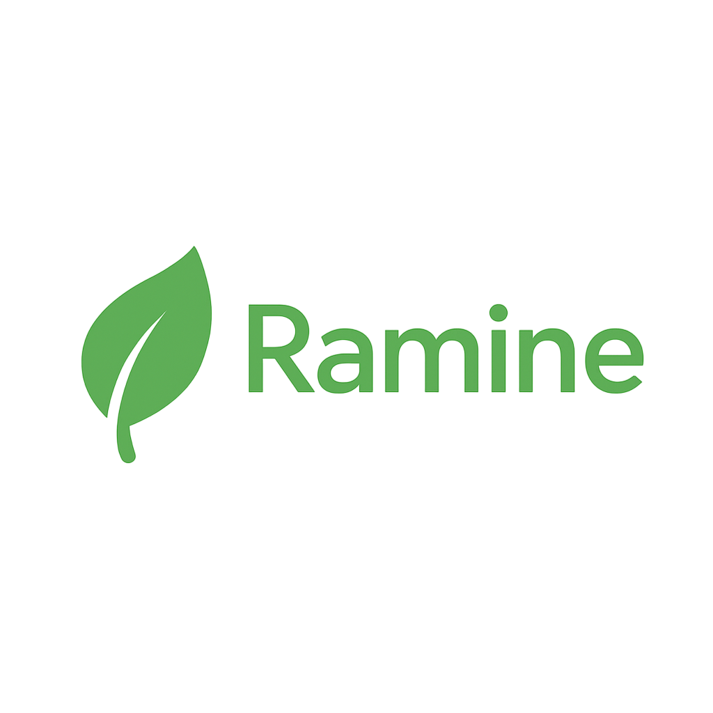

# Ramine Linux

  

**Debianベースの軽量で美しい日本語対応Linuxディストリビューション**  

---

## 📝 概要
Ramine Linuxは、Debian 12（"Bookworm"）をベースとした軽量でユーザーフレンドリーなLinuxディストリビューションです。低リソース環境向けに設計されており、モダンな外観や使いやすさを犠牲にしません。

### 主な特徴：
- 🌏 **完全日本語対応**（Fcitx5 + Mozc プリ設定済み）
- 🌐 **Firefox プリインストール**（最新版）
- 💽 **Calamaresグラフィカルインストーラー（ベータ版）**
- 📦 **Flatpakサポート**（Snapは非対応）
- 🧩 **Debian互換性**（APTパッケージシステム）

---

## 🎨 エディションについて

Ramine Linux には、用途やハードウェア環境に合わせた2つのエディションがあります。

### 🖥️ **Standard Edition (MATE)**

* **標準エディション**。パフォーマンスと見た目のバランスを重視。
* **MATEデスクトップ環境**を採用。軽量かつGTKベースで、親しみやすく整ったUI。
* **Arc GTKテーマ**と**Papirusアイコンテーマ**をプリセット。
* 一般的なPCやノートPCに最適。
* 日本語環境完全対応（日本語フォント・Fcitx5 + Mozc事前設定済み）。

### 💡 **Light Edition (LXQt)**

* **超軽量・低リソース向け**エディション。古いPCや低性能マシン向け。
* **LXQtデスクトップ環境**を使用し、見た目よりも動作速度・軽さを最優先。
* 視覚効果を最小限に抑え、パフォーマンスを最大化。
* メモリやCPU性能が厳しい環境向けにおすすめ。
* こちらも日本語環境（Fcitx5 + Mozc）対応。

---

## 🚀 ダウンロード
🔗 [最新リリース (1.0-beta)](https://github.com/ra-mu-ne/ramine/releases)

---

## 💡 システム要件
| コンポーネント | 最小要件 |
|-------------|---------|
| CPU         | x86_64（64ビット） |
| RAM         | 1 GB（アイドル時700MiB） |
| ストレージ    | 8 GB（最小インストール） |
| ブートモード  | BIOS（UEFI対応は開発中） |

---

## 📦 同梱ソフトウェア
- **MATEデスクトップ環境**
- **Firefox 最新安定版**
- **Fcitx5 + Mozc（日本語IME）**
- **Flatpak**
- Debianコアユーティリティ

---

## ⚠️ 既知の問題（1.0-beta）
- Calamaresインストーラーはベータ版で、手動パーティショニングが必要な場合があります。
- UEFI対応は実験的です（BIOS推奨）。
- ソフトウェアセンターは含まれていません。
- Snapパッケージには対応していません。

---

## 🛣️ ロードマップ
- UEFI完全対応
- Calamaresの改善
- オプションのプリインストールソフトウェア
- Ramineドキュメントとwiki

---

## 🤝 貢献
コントリビューション、バグレポート、機能要求を歓迎します！  
[issue](https://github.com/ra-mu-ne/ramine/issues)を開くか、プルリクエストを送信してください。

---

## 📜 ライセンス
このプロジェクトは[GPLv3](https://github.com/ra-mu-ne/ramine/blob/master/LICENSE)ライセンスの下で提供されています。

---

## 🙏 クレジット
[ra-mu-ne](https://github.com/ra-mu-ne)プロジェクトによって作成・保守されています。  
[Debian GNU/Linux](https://www.debian.org/)をベースにしています。

---

## 📬 お問い合わせ
フィードバックやご質問については、[issue](https://github.com/ra-mu-ne/ramine/issues)を開くか、GitHub経由でお気軽にご連絡ください。
